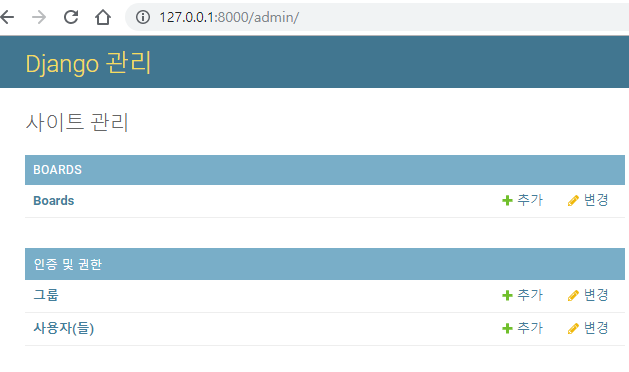

# MODEL


## 모델 생성

1. `boards/model.py` 수정

​	

```python
from django.db import models

# class 클래스명(상속받을 클래스):
class Board(models.Model):
    # id는 기본적으로 테이블 생성시 자동으로 만들어진다.
    # id = models.AutoField(primary_key=True)  # auto-incrementing primary key.
    
	title = models.CharField(max_length=10) # 문자타입 + 10자 제한
    content = models.TextField()
    created_at = models.DateTimeField(auto_now_add=True)  # 객체 생성시의 시간
    updated_at = models.DateTimeField(auto_now=True)  # 
```

​	

​	2. `boards/settings.py` 수정

​		model에서 설정한 auto date 값에 timezone 을 적용하기 위한 설정

```python
USE_TZ = False
# 모든 작업에 위에서 설정한 timezone 이 적용된다.

# USE_TZ = True
# use timezone , form, templates 에서만 위에 설정한 timezone 이 적용된다.
```


3. 모델 작성 끝나면 생성한 모델을 식별시켜준다. 

   $ python manage.py makemigrations  

   boards/migrations/ 디렉토리 안에 모델과 비슷한 파일이 생성될 것이다.

> 다음과 같이 에러가 뜰 경우 boards/settings.py 에서 installed_app 설정이 안된 것 
>
> $ python manage.py makemigrations
> No changes detected


​	4. model 변경 시  boards/models.py를 수정하고 변경사항을 식별시켜준다.

```
- 하나의 app만 적용할 경우

$ python manage.py migrate boards 

- 모든 app을 찾아서 적용할 경우

$ python manage.py migrate

```


## CREATE 

$ python manage.py shell

```bash
Python 3.7.1 (default, Dec 10 2018, 22:54:23) [MSC v.1915 64 bit (AMD64)] on win32
Type "help", "copyright", "credits" or "license" for more information.
(InteractiveConsole)

# 모델 import 
>>> from boards.models import Board
# SELECT * FROM boards
>>> Board.objects.all()
<QuerySet []>

--- 첫번째 방법 ---
# 객체 생성
>>> board = Board()

# 값 입력하기
>>> board.title = 'new board'
>>> board.content = 'hello world!'
>>> board
<Board: Board object (None)>  # DB에 저장하지 않아 빈 값이 출력된다

# DB에 저장하기
>>> board.save()

# 결과 확인
>>> board
<Board: Board object (1)>
>>> board.id
1
>>> Board.objects.all()
<QuerySet [<Board: Board object (1)>]>

--- 두번째 방법 ---
# 인스턴스 생성시 값을 입력할 수 있다.
>>> board = Board(title="second board",content="Django !")
>>> board.save()
>>> board
<Board: Board object (2)>

--- 세번째 방법 ---
>>> Board.objects.create(title="third board", content="Happy Hacking")
<Board: Board object (3)>

# 유효성 검사
>>> board = Board()
>>> board.title="new board"
>>> board.full_clean()
...
django.core.exceptions.ValidationError: {'content': ['이 필드는 빈 칸으로 둘 수 없습니다.']}\

```


모델 인스턴스 출력을 위한 형식 지정

`boards.models.py` 수정

```python
    # 인스턴스 자체를 출력할 때 형식을 지정하는 메서드
    def __str__(self):
        return f'{self.id}번째 글 - {self.title} : {self.content}'
```

$ python manage.py shell

```bash
>>> from boards.models import Board
>>> Board.objects.all()
<QuerySet [<Board: 1번째 글 - new board : hello world!>, <Board: 2번째 글 - second board : Django !>, <Board: 3번째 글 - third b
oard : Happy Hacking>]>
```


## admin page

`boards/admin.py` 수정

```python
from django.contrib import admin
from .models import Board

# Register your models here.
admin.site.register(Board)
```


관리자 계정 생성

$ python manage.py createsuperuser

```bash
사용자 이름 (leave blank to use 'woong'): woong
이메일 주소:
Password:
Password (again):

비밀번호가 너무 짧습니다. 최소 8 문자를 포함해야 합니다.
비밀번호가 전부 숫자로 되어 있습니다.
Bypass password validation and create user anyway? [y/N]: y
Superuser created successfully.
```


관리자 페이지 접속

$ python manage.py runserver

웹브라우저 주소창에  http://127.0.0.1:8000/admin 으로 접속

위에서 생성한 관리자 계정으로 로그인




## READ

$ python manage.py shell

```bash
>>> from boards.models import Board

# SELECT * FROM boards;
>>> Boards.objects.all()

# SELECT * FROM boards WHERE title = 'new board';
>>> Board.objects.filter(title="new board")
<QuerySet [<Board: 1번째 글 - new board : hello world!>]>

# SELECT * FROM boards WHERE title = 'new board' LIMIT 1;
>>> Board.objects.filter(title="new board").first()
<Board: 1번째 글 - new board : hello world!>

# SELECT * FROM boards WHERE id = 1;
 1. filter 사용
>>> Board.objects.filter(id=1)
<QuerySet [<Board: 1번째 글 - new board : hello world!>]>

 2. get 사용 
 >>> Board.objects.get(id=1)	
<Board: 1번째 글 - new board : hello world!>
 	(primary key만 get으로 가져올 수 있다. 
 	 get은 값이 중복이거나 일치하는 갑싱 없으면 오류 발생)

# SELECT * FROM boards ORDER BY title ASC;
>>> Board.objects.order_by('title').all()

# SELECT * FROM boards ORDER BY title DESC;
>>> Board.objects.order_by('-title').all()

# index로 호출하기
>>> board = Board.objects.all()[2]
>>> board
<Board: 3번째 글 - third board : Happy Hacking>

>>> boards = Board.objects.all()[1:3]
>>> boards
<QuerySet [<Board: 2번째 글 - second board : Django !>, <Board: 3번째 글 - third board : Happy Hacking>]>

# QuerySet은 List처럼 index 접근 및 list methods 중 일부 사용 가능하지만 list type은 아니다
>>> type(boards)
<class 'django.db.models.query.QuerySet'>
>>> type(board)
<class 'boards.models.Board'>

# LIKE
>>> Board.objects.filter(content__contains="Happy")

# Startswith (~로 시작)
 Board.objects.filter(content__startswith="Happy")
 
# Endswith(~로 끝)
 >>> Board.objects.filter(content__endswith="!")
```


## UPDATE

$ python manage.py shell

```bash
>>> from boards.models import Board

#  pk=1인 row 읽어오기
>>> board = Board.objects.get(pk=1)
>>> board
<Board: 1번째 글 - new board : hello world!>

# 내용 변경
>>> board.title = 'old board'
>>> board.title
'old board'

# 업데이트
>>> board.save()

# 결과확인
>>> board
<Board: 1번째 글 - old board : hello world!>
```


## DELETE

$ python manage.py shell

```bash
>>> from boards.models import Board

# pk=1인 row 읽어오기
>>> board = Board.objects.get(pk=1)
>>> board
<Board: 1번째 글 - old board : hello world!>

# 삭제하기
>>> board.delete()
(1, {'boards.Board': 1})

# 결과확인 - 삭제한 row 읽어오기
>>> board = Board.objects.get(pk=1)
	... ...
boards.models.Board.DoesNotExist: Board matching query does not exist.
```
