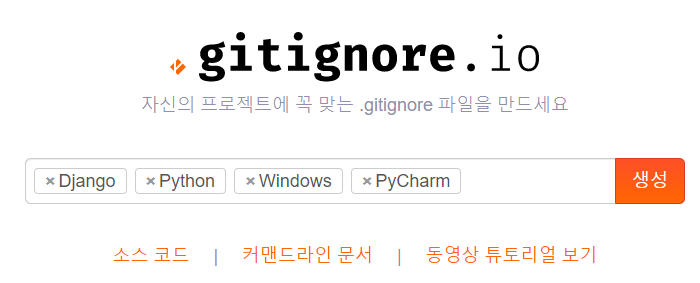
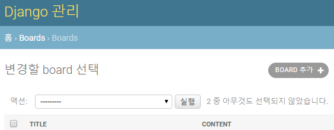

# Dajngo Form


## django 설치

$ pip install django

$ django-admin startproject django_form .

$ python manage.py runserver

​	http://127.0.0.1:8000/  로 접속해서 홈페이지 뜨는지 확인

$ python manage.py startapp boards


## django_form/settings.py 수정

```python
#...
INSTALLED_APPS = [
    # local apps
    'boards',

    # django apps
    #...
]
#...
LANGUAGE_CODE = 'ko-kr'

TIME_ZONE = 'Asia/Seoul'
#...
```


## .gitignore 생성

<https://www.gitignore.io/>




## boards/models.py 수정

```python
from django.db import models


class Board(models.Model):
    title = models.CharField(max_length=20)  # input
    content = models.TextField()  # textarea
    createed_at = models.DateField(auto_now_add=True)
    updated_at = models.DateField(auto_now=True)
```

 - 모델 생성 후 migration

   $ python manage.py makemigrations

   $ python manage.py migrate


## boards/admin.py 수정

```python
from django.contrib import admin
from .models import Board


@admin.register(Board)  # Board 를 이용한 페이지?
class BoardAdmin(admin.ModelAdmin):  # admin.ModelAdmin 을 상속받는다.
    list_display = ('title', 'content', 'created_at', 'updated_at',)  # 목록에서 보여줄 필드 설정
    readonly_fields = ['created_at', 'updated_at', ]  # 읽기전용 필드를 볼 수 있도록 추가
```

​	<http://127.0.0.1:8000/admin/>




