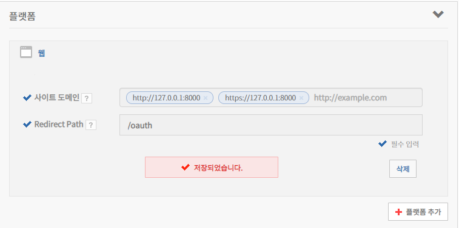
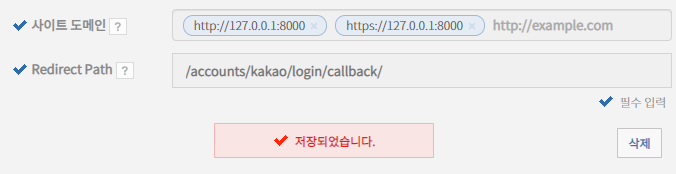
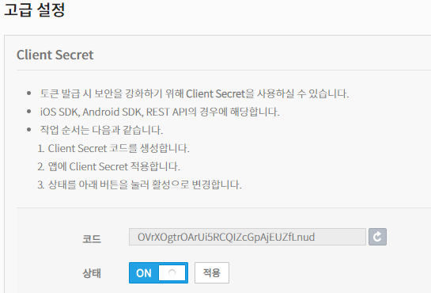
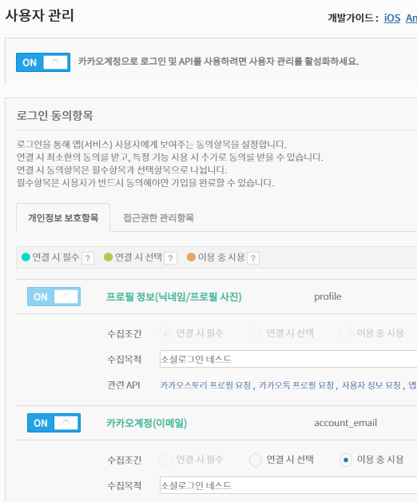
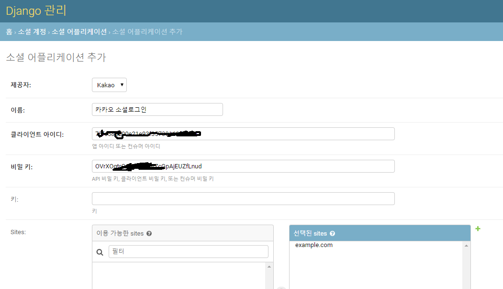
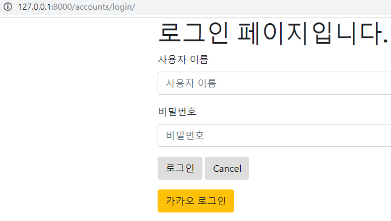
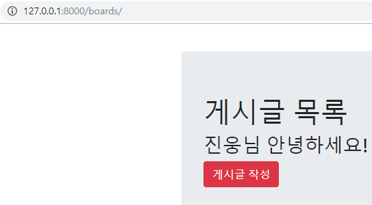

# social login 

<https://django-allauth.readthedocs.io/en/latest/installation.html>

<https://wikidocs.net/9942>

참조


$ pip install django-allauth

django_form/settings.py 수정

```python
#...
# 추가
AUTHENTICATION_BACKENDS = (
    'django.contrib.auth.backends.ModelBackend',
    'allauth.account.auth_backends.AuthenticationBackend',
)

INSTALLED_APPS = [
    #...
    # 3rd party apps
    'bootstrap4',
    'allauth',	# 추가
    'allauth.account',  # 추가
    'allauth.socialaccount',  # 추가
    'allauth.socialaccount.providers.kakao',  # 추가

    # django apps
	#...
    'django.contrib.sites',  # 추가
]
SITE_ID = 1


```


django_form/urls.py 수정

```python
#...
urlpatterns = [
    #...
	path('accounts/', include('allauth.urls')),  # 추가
]
```


$ python manage.py migrate


kakao developer

앱만들기 ->

내어플리케이션 -> 플랫폼 추가

​	http://127.0.0.1:8000  	https://127.0.0.1:8000



​	


callback -> 외부(ex카카오)에서 login 성공 후 보여줄 페이지 지정




왼쪽 탭 -> 고급 -> 생성 + 상태 ON으로 변경 후 적용




왼쪽 탭-> 사용자 관리

사용자 관리를 활성화 OFF => ON



​									테스트를 위해 이메일까지만 ON => 저장


<http://127.0.0.1:8000/admin/> 로 이동

소셜 어플리케이션 추가 



클라이언트 아이디 : 내 어플리케이션,일반에서 REAT API 키

비밀키 : 내 어플리케이션, 고급에서 Client Secret 코드

입력


소셜로그인 버튼 추가

accounts/login.html 수정

```html


  <!--  추가 -->

#...
</form>
<!-- 추가 -->
<a href="" class="btn btn-warning">카카오 로그인</a> 

```

​	method='oauth2' : 카카오 provider를 사용하기 위한 프로토콜 같은 개념


django_form/settings.py 수정

```python
#...
LOGIN_REDIRECT_URL = 'boards:index'
```


카카오 로그인 테스트





   - 카카오 로그인 클릭시 index 페이지가 뜨면서 로그인되면 성공


소셜 계정 로그아웃 후 회원가입 시 backend 충돌로 인한 에러 발생

django_form/settings.py 수정해서 주석처리

```python
# Application definition
AUTHENTICATION_BACKENDS = (
    'django.contrib.auth.backends.ModelBackend',
    # 'allauth.account.auth_backends.AuthenticationBackend',  # 회원가입시 충돌을 처리하기 위해 주석처리
)
```


