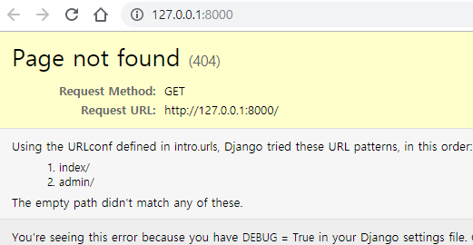
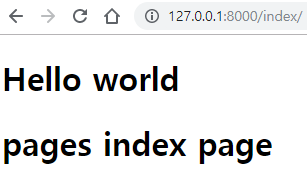

# Django - MTV


## MTV

- 일반적으로 MVC 패턴을 사용하지만 Django는 MTV 패턴을 사용한다.
- Model : 테이블 정의  ≒ MVC_model
- Template : 사용자가 보게 될 화면 정의 ≒ MVC_View
- View : 어플리케이션 제어 흐름 및 처리 로직 정의 ≒ MTC_Controller

```
app의 models.py 에서 데이터베이스 관리

app의 views.py 에서 페이지 관리 (페이지 이동)

Django project의 urls.py 에서 URL주소 관리 (url을 views.py에 매핑)
```


*해당 프로젝트에서는 Model은 나중에 다루고 Template와 View를 먼저 다룬다.*


## 페이지 추가 순서

1. `urls.py` - 특정 url을 views.py 의 함수에 매핑하도록 정의
2. `views.py` - 특정 html로 이동시키는 함수 정의
3. `html 파일생성` - 사용자에게 보여줄 페이지 생성

순서는 정해져 있지 않고 위의 파일들이 적절히 수정 및 생성되면 된다.

습관을 들이기 위해 


### index 페이지 추가

*앞서 생성한 프로젝트 이름은 intro, app 이름은 pages*

  1. urls.py 수정

     ```python
     from django.contrib import admin
     from django.urls import path
     from pages import views  # 매핑시켜줄 views
     
     urlpatterns = [
         path('index/', views.index),  # index라는 url로 들어오면 views의 index를 호출한다. 
         path('admin/', admin.site.urls), # 처리할 url 뒤에 /(슬래쉬)를 붙여주자.
     ]
     ```

     

  2. views.py 수정

     ```python
     from django.shortcuts import render
     
     def index(request):  # request : 사용자의 요청
         return render(request, 'index.html')  # index.html 로 이동 + request 전달
     
     # -> urls.py에서 index 함수를 호출하면 index.html 페이지로 이동한다
     ```

     

  3. app 내에 templates 폴더를 생성한다.

     - Django가 templates 폴더에서 html파일을 찾는다.
     - 즉, 앞으로 html파일들을 templates에 추가한다.
     - 현재 app은 pages이므로 pages 폴더 내에 templates 폴더 생성

     

  4. index.html 생성

     - pages/templates/ 에 추가한다.

       ```html
       <!DOCTYPE html>
       <html lang="en">
       <head>
           <meta charset="UTF-8">
           <title>Title</title>
       </head>
       <body>
           <h1>Hello world</h1>
           <h1>pages index page </h1>
       </body>
       </html>
       ```

     

     

  5. 웹으로 index 접속

     - $ python manage.py runserver

       

     - ' / ' (root) 페이지에 대한 설정이 없으므로 에러 페이지가 출력된다.

     - 주소에 /index를 추가하여 index를 요청하자

       

     - 위와 같이 정상적으로 index.html 페이지가 출력된다.


