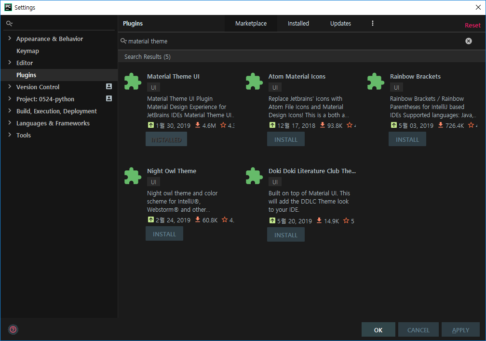
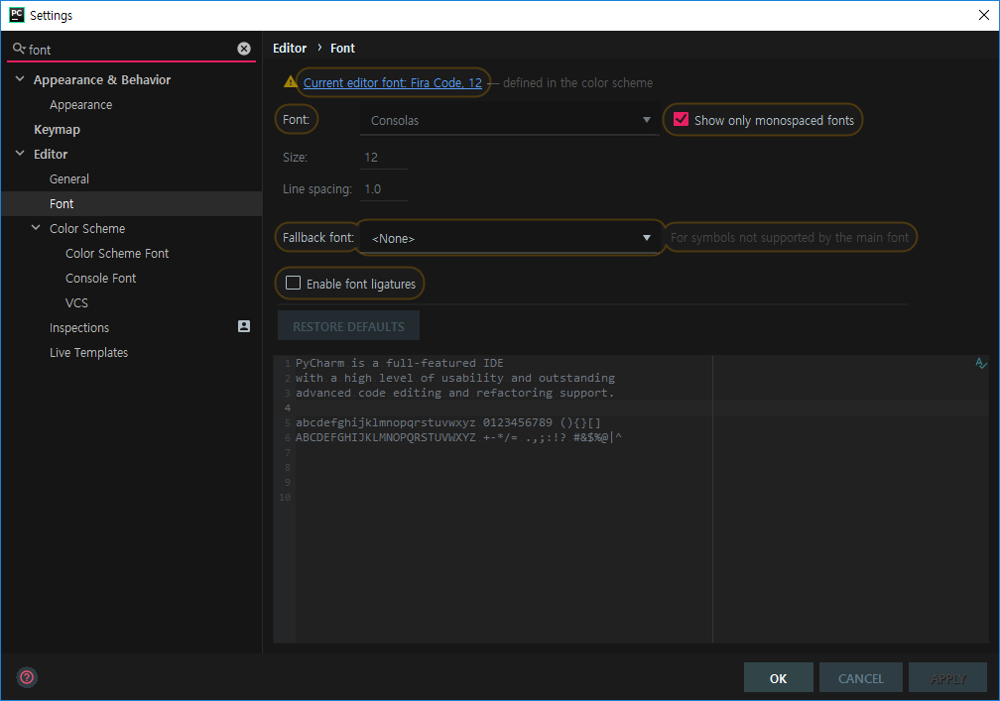
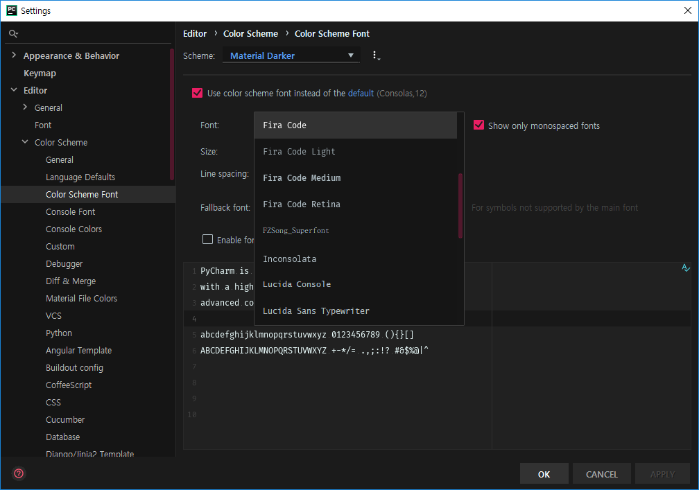
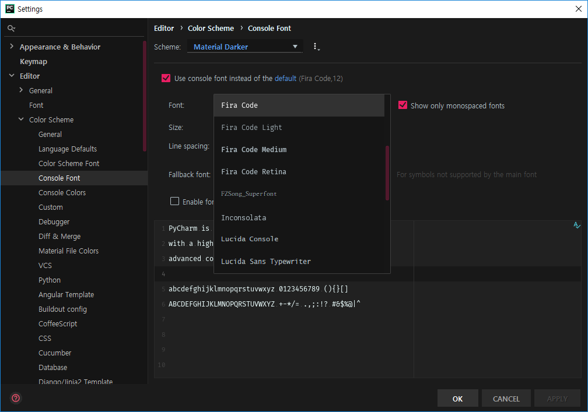

Pycharm GUI 설정

1. Theme 변경

   

   - Settings > Plugins >  Meterial Theme 검색 > INSTALL

2. Pycharm 재시작 

3. 폰트 변경

   

   - Theme를 설치한 경우 `Currernt editor font Fira Code. 12`를 눌러서 폰트 설정

   - 

     

4. 콘솔 폰트 변경

   

   
   
   

